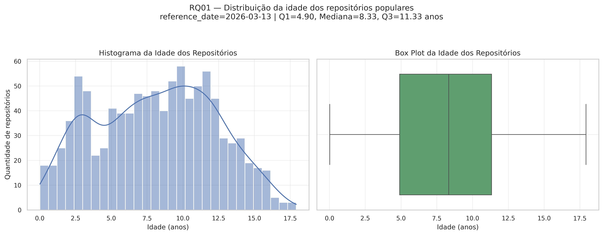
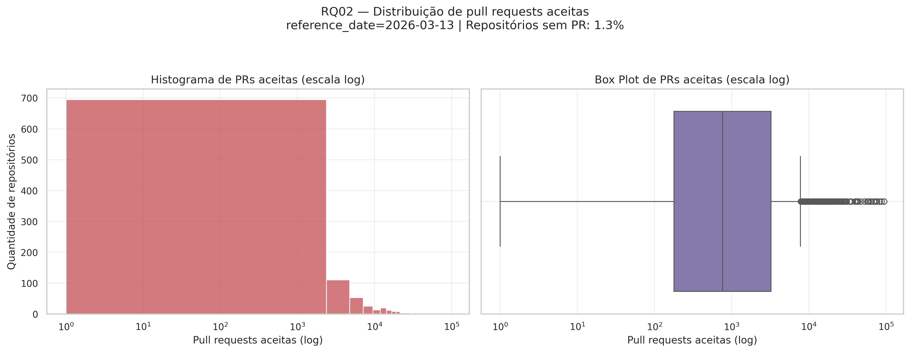
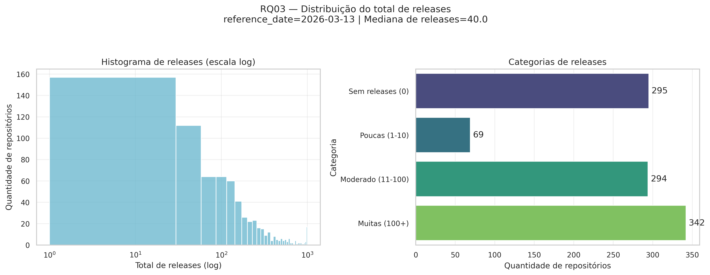
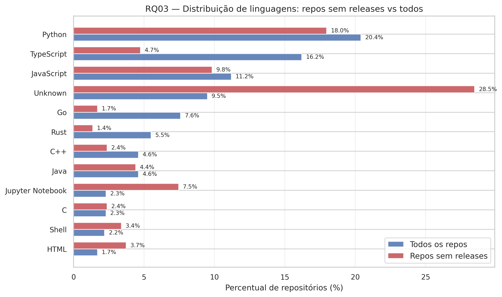
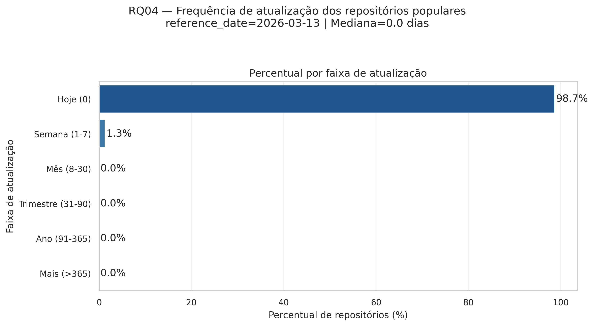
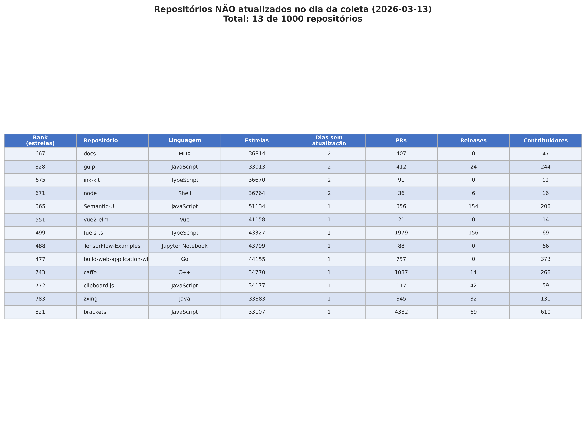
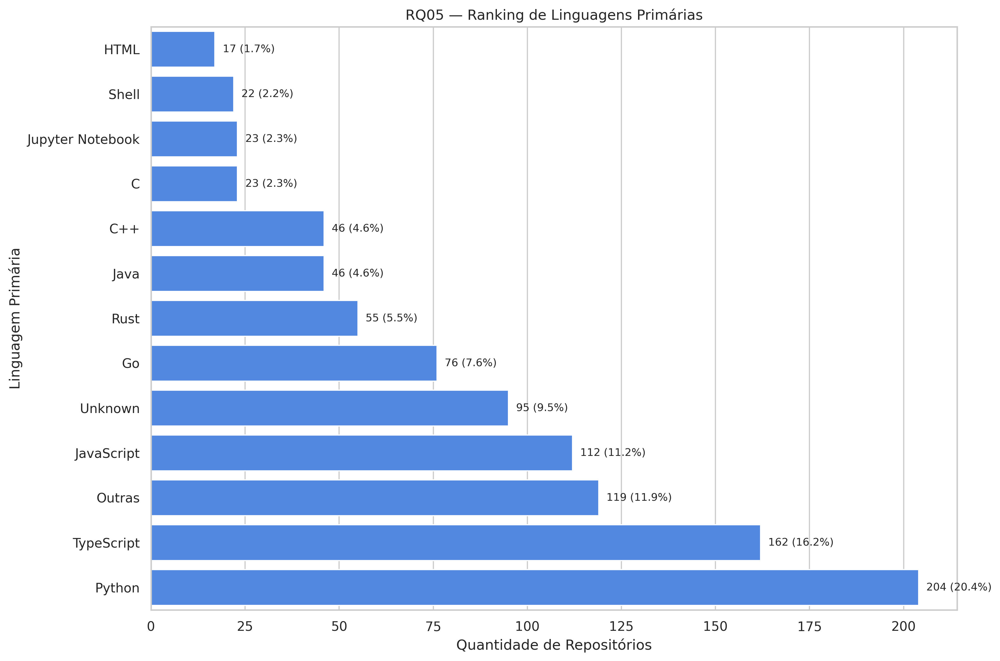
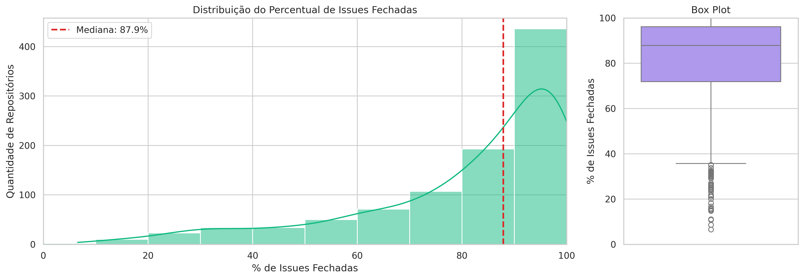
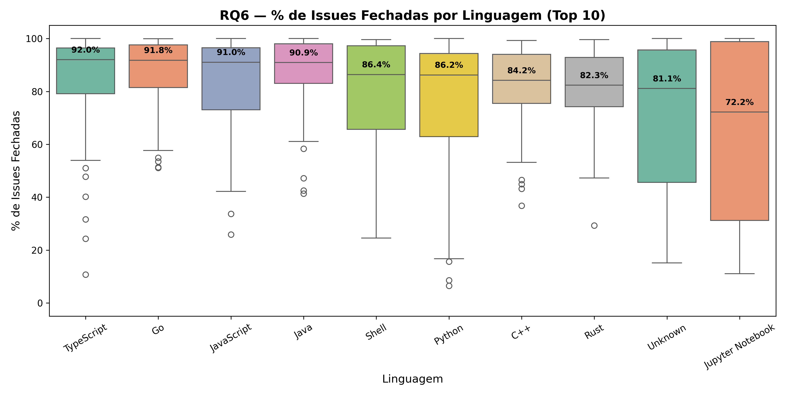

# Caracterização dos 1.000 Repositórios Mais Populares do GitHub: Um Estudo Empírico Observacional

---

# 1 Introdução

## 1.1 Contextualização

O desenvolvimento de sistemas de código aberto (open-source) transformou a maneira como o software é construído e mantido globalmente. O GitHub, sendo a principal plataforma de hospedagem de código, possui uma vasta quantidade de dados sobre a evolução desses projetos. Compreender como os repositórios mais populares do mundo operam e são desenvolvidos nos permite identificar padrões de sucesso e maturidade na engenharia de software.

## 1.2 Problema foco do experimento

O problema central consiste em identificar e analisar as principais características de sistemas populares open-source hospedados no GitHub. Busca-se entender a dinâmica de desenvolvimento desses projetos, abrangendo a maturidade temporal, a frequência de contribuições externas, o ritmo de atualizações e lançamentos, a gestão de issues e as linguagens de programação predominantes.

## 1.3 Questões-Pesquisa

O estudo é guiado pelas seguintes questões de pesquisa (RQs):

- **RQ 01:** Sistemas populares são maduros/antigos?
- **RQ 02:** Sistemas populares recebem muita contribuição externa?
- **RQ 03:** Sistemas populares lançam releases com frequência?
- **RQ 04:** Sistemas populares são atualizados com frequência?
- **RQ 05:** Sistemas populares são escritos nas linguagens mais populares?
- **RQ 06:** Sistemas populares possuem um alto percentual de issues fechadas?
- **RQ 07:** Linguagens populares influenciam contribuição, releases e frequência de atualização? (**Bônus**)

## 1.4 Hipótese(s)

Com base na observação empírica do ecossistema open-source, foram formuladas as seguintes hipóteses:

- **H1 (Maturidade):** Espera-se que os sistemas mais populares sejam maduros, com vários anos de desenvolvimento, refletindo a necessidade de tempo para acumular visibilidade e comunidade.
- **H2 (Contribuição externa):** Espera-se que projetos populares apresentem alta taxa de contribuição externa (pull requests aceitas), indicando uma comunidade ativa de colaboradores.
- **H3 (Releases):** Espera-se que a maioria dos projetos populares possua um histórico significativo de releases formais, sinalizando práticas de entrega contínua.
- **H4 (Atualização):** Espera-se que projetos populares sejam frequentemente atualizados, refletindo manutenção ativa.
- **H5 (Issues):** Espera-se que projetos populares possuam alto percentual de issues fechadas, indicando capacidade de resposta da equipe de manutenção.
- **H6 (Linguagens):** Espera-se que as linguagens mais populares do mercado (Python, JavaScript, TypeScript) dominem entre os repositórios mais estrelados.

## 1.5 Objetivo (principal e específicos)

**Objetivo principal:** Coletar e analisar métricas específicas dos 1.000 repositórios com maior número de estrelas no GitHub para caracterizar e compreender os padrões de desenvolvimento dos projetos open-source mais populares.

**Objetivos específicos:**

1. Implementar um script de mineração de dados utilizando a API GraphQL do GitHub para coleta automatizada dos dados.
2. Sumarizar os dados obtidos por meio de valores medianos, quartis e contagens por categoria.
3. Gerar visualizações gráficas para cada questão de pesquisa.
4. Confrontar os resultados com as hipóteses iniciais e com trabalhos correlatos na literatura.

---

# 2 Metodologia

Este trabalho caracteriza-se como um estudo empírico observacional, com análise quantitativa descritiva de repositórios de software hospedados no GitHub. A estratégia adotada concentrou-se na extração automatizada de dados públicos por meio da API GraphQL do GitHub, seguida do armazenamento estruturado dos resultados e posterior análise estatística.

## 2.1 Passo a passo do experimento

O experimento foi executado nas seguintes etapas sequenciais:

**Etapa 1 — Definição das questões de pesquisa:** Foram estabelecidas sete questões de pesquisa (RQ01–RQ07), cada uma associada a uma métrica observável no GitHub. Essa definição orientou a escolha dos campos da query GraphQL e delimitou quais dados deveriam ser extraídos de cada repositório.

**Etapa 2 — Construção da consulta GraphQL:** Foi elaborada a consulta GraphQL com foco nos repositórios mais populares da plataforma, utilizando o critério `stars:>1000 sort:stars-desc`. A consulta inclui, para cada repositório, atributos como nome, URL, data de criação (`createdAt`), data da última atualização (`updatedAt`), linguagem primária, quantidade de releases, total de pull requests aceitas (estado `MERGED`) e totais de issues abertas e fechadas.

**Etapa 3 — Implementação da paginação:** Como a API não retorna os 1.000 repositórios em uma única resposta, foi implementado um mecanismo de paginação baseado em cursor. A cada requisição, o sistema consulta `pageInfo.endCursor` e `hasNextPage` para determinar se existe nova página disponível e, em caso afirmativo, utiliza o cursor retornado para a próxima busca.

**Etapa 4 — Execução da coleta automatizada:** O programa instancia o fetcher escolhido, realiza a coleta das páginas configuradas (10 repositórios por página, 100 páginas), padroniza os dados recebidos e acumula os registros em memória durante a execução.

**Etapa 5 — Exportação dos dados:** Ao final da coleta, os repositórios processados são exportados para arquivo CSV. Esse arquivo consolida todos os campos necessários às questões de pesquisa e serve como base para as análises estatísticas e visuais.

**Etapa 6 — Análise estatística e geração de visualizações:** A partir do CSV, scripts de análise calculam estatísticas descritivas (mediana, quartis, IQR, contagens) e geram gráficos para cada RQ.

## 2.2 Decisões

Durante a execução do experimento, algumas decisões metodológicas e técnicas foram tomadas:

1. **Tamanho da página:** Embora tenham sido testadas páginas maiores (50, 40 e 25 repositórios por requisição), essas configurações produziram respostas muito pesadas, levando a erros `502` na API do GitHub. Optou-se por fixar a coleta em **10 repositórios por página**, totalizando **100 páginas**, como compromisso entre desempenho e robustez.

2. **Critério de exclusão (RQ06):** Repositórios sem nenhuma issue (40 do total) foram excluídos do cálculo percentual de fechamento de issues, resultando em uma base válida de 960 repositórios para essa métrica.

## 2.3 Materiais utilizados

- **Plataforma GitHub** como fonte dos dados observados.
- **API GraphQL do GitHub** para consulta estruturada dos repositórios.
- **GitHub CLI (`gh`)** e cliente HTTP em Python como alternativas de execução da coleta.
- **Linguagem Python** para automação da coleta, tratamento das respostas e exportação dos dados.
- Bibliotecas **`requests`**, **`python-dotenv`** e **`rich`** para comunicação HTTP, gerenciamento de variáveis de ambiente e formatação de saída em console.
- Consulta GraphQL.
- Scripts de coleta.
- Scripts de análise.
- Arquivo CSV de saída`.

## 2.4 Métodos utilizados

Foi utilizado o método de **Mineração de Repositórios de Software (MSR — Mining Software Repositories)** aliado a requisições de rede paginadas para a coleta de dados.

Para a análise quantitativa, adotou-se **estatística descritiva**: a sumarização dos dados numéricos contínuos e discretos utiliza a **mediana** como medida de tendência central (por ser robusta a outliers), complementada por **quartis (Q1, Q3)** e **intervalo interquartil (IQR)** para caracterização da dispersão. Os dados categóricos foram avaliados por **contagem simples e proporções percentuais**.

## 2.5 Métricas e suas Unidades

As métricas observadas no experimento foram definidas a partir das questões de pesquisa. O quadro a seguir sintetiza cada métrica, sua descrição operacional e unidade de medida.

| Questão | Métrica | Descrição operacional | Unidade |
| --- | --- | --- | --- |
| RQ01 | Idade do repositório | Diferença entre a data de coleta (`collectedAt`) e `createdAt` | anos |
| RQ02 | Pull requests aceitas | Quantidade total de pull requests com estado `MERGED` | contagem (inteiro) |
| RQ03 | Releases | Quantidade total de releases registradas no repositório | contagem (inteiro) |
| RQ04 | Frequência de atualização | Diferença entre a data de coleta (`collectedAt`) e a data da última atualização (`updatedAt`) | dias |
| RQ05 | Linguagem primária | Linguagem principal associada ao repositório pela API do GitHub | categoria nominal |
| RQ06 | Percentual de issues fechadas | Razão entre issues fechadas e total de issues (abertas + fechadas) × 100 | percentual (%) |
| RQ07 | Métricas segmentadas por linguagem | Comparação cruzada das métricas de RQ02, RQ03 e RQ04 entre as linguagens primárias do top 10 | contagem, dias |

**Nota sobre RQ04 — Frequência de atualização:** A métrica de frequência de atualização é calculada como a diferença, em dias, entre a data de coleta dos dados (`collectedAt`) e a data da última atualização do repositório (`updatedAt`), conforme registrado pela API do GitHub. Formalmente: `days_since_update = collectedAt − updatedAt`. Um valor de 0 indica que o repositório foi atualizado no mesmo dia da coleta. A referência temporal utilizada foi `13 de março de 2026`.

**Nota sobre RQ06 — Percentual de issues fechadas:** A fórmula utilizada é:

$$
\text{Percentual de issues fechadas} = \frac{\text{issues fechadas}}{\text{issues abertas} + \text{issues fechadas}} \times 100
$$

---

# 3 Resultados e Discussão

Os resultados desta seção foram consolidados a partir dos **1.000 repositórios válidos** coletados com referência temporal reproduzível em `13 de março de 2026`. Para cada questão de pesquisa, apresentam-se as estatísticas descritivas, visualizações gráficas, discussão interpretativa e, quando aplicável, análises complementares.

---

## 3.1 RQ01 — Sistemas populares são maduros/antigos?

### Estatísticas descritivas

**Tabela 1 — Estatísticas descritivas da idade (em anos)**

**Tabela 2 — Distribuição por faixa de idade**

### Visualizações

### Discussão

---

## 3.2 RQ02 — Sistemas populares recebem muita contribuição externa?

### Estatísticas descritivas

**Tabela 3 — Estatísticas descritivas de PRs aceitas**

### Visualizações

### Discussão

---

## 3.3 RQ03 — Sistemas populares lançam releases com frequência?

### Estatísticas descritivas

**Tabela 4 — Estatísticas descritivas de releases**

**Tabela 5 — Distribuição por faixa de releases**

### Visualizações

### Discussão

### Análise complementar: Repositórios sem releases

Para compreender melhor o grupo de **295 repositórios** sem nenhuma release, foram conduzidas análises sobre sua composição por linguagem e perfil.

A distribuição de linguagens entre repositórios sem releases difere significativamente da distribuição geral: categorias como Unknown e Jupyter Notebook estão sobre-representadas, sugerindo que muitos desses repositórios são coleções de documentação, dados, *awesome lists* ou tutoriais — projetos que, por natureza, não utilizam releases formais como mecanismo de distribuição.

Entre os 30 repositórios sem releases com maior número de estrelas, observam-se tanto projetos de documentação e curadoria (como *awesome lists*, guias de estudo) quanto projetos de software propriamente dito que utilizam estratégias alternativas de distribuição (como Docker images ou instalação via pip/npm sem releases no GitHub).

A distribuição de releases segmentada por linguagem revela que TypeScript e Go apresentam as maiores proporções de repositórios com 100+ releases, coerente com ecossistemas que incentivam versionamento semântico e publicação frequente em registros de pacotes.

---

## 3.4 RQ04 — Sistemas populares são atualizados com frequência?

### Estatísticas descritivas

**Tabela 6 — Estatísticas descritivas de dias desde a última atualização**

**Tabela 7 — Distribuição por faixa de atualização**

### Visualizações

### Discussão

### Análise complementar: Repositórios não atualizados no dia da coleta

Os **13 repositórios** que não foram atualizados no dia da coleta merecem análise individual para identificar possíveis padrões.

A tabela acima detalha os 13 repositórios com `days_since_update > 0`, incluindo ranking por estrelas, linguagem, dias desde a última atualização, PRs, releases e contribuidores. Entre eles encontram-se projetos notáveis como:

Analisando o ranking de estrelas versus dias desde a última atualização, observa-se que os repositórios não atualizados recentemente tendem a ocupar posições intermediárias ou inferiores no ranking (posições 365–828), sugerindo que repositórios no topo absoluto mantêm atualização mais consistente.

---

## 3.5 RQ05 — Sistemas populares são escritos nas linguagens mais populares?

### Estatísticas descritivas

**Tabela 8 — Ranking das 12 linguagens primárias mais frequentes**

### Visualizações

### Discussão

---

## 3.6 RQ06 — Sistemas populares possuem um alto percentual de issues fechadas?

### Estatísticas descritivas

**Base válida:** 960 repositórios (40 excluídos por ausência de issues).

**Tabela 9 — Estatísticas descritivas do percentual de issues fechadas**

**Tabela 10 — Distribuição por faixa de percentual de issues fechadas**

### Visualizações

### Discussão

### Análise complementar: Relação com linguagem, idade e contribuidores

A segmentação por linguagem revela que TypeScript (**92,0%**), Go (**91,8%**), JavaScript (**91,0%**) e Java (**90,9%**) apresentam as maiores medianas de fechamento de issues, enquanto Jupyter Notebook (**72,2%**) e Unknown (**81,1%**) ficam abaixo da mediana geral. Essa diferença pode refletir tanto a natureza dos projetos associados a cada linguagem quanto a maturidade dos processos de triagem adotados por suas comunidades.

---

## 3.7 Síntese cross-RQ

---

# 4 Insights Adicionais

## 4.1 Perfil de repositórios "não-software"

A análise dos **295 repositórios sem releases** (RQ03) revelou um subgrupo significativo de projetos que não se enquadram no modelo tradicional de desenvolvimento de software:

- Repositórios classificados como `Unknown` (sem linguagem primária detectável) e `Jupyter Notebook` apresentam mediana de releases igual a **0,0**.
- Entre os repositórios mais estrelados sem releases, encontram-se *awesome lists*, guias de entrevista, tutoriais e coleções de referência — projetos de **curadoria de conhecimento** que utilizam o GitHub como plataforma de publicação, não como ferramenta de versionamento de software.
- Esses repositórios apresentam medianas de PRs significativamente menores (**129,0** para Unknown, **88,0** para Jupyter Notebook) em comparação com projetos de engenharia, confirmando um perfil de atividade distinto.

Essa observação levanta uma questão metodológica relevante: estudos empíricos baseados nos repositórios mais estrelados do GitHub devem considerar que aproximadamente **10–15%** da amostra pode não representar projetos de engenharia de software no sentido estrito.

---

# 5 Conclusão

## 5.1 Tomada de decisão

## 5.2 Sugestões futuras

## 5.3 Resultado conclusivo sucinto

Este estudo analisou os 1.000 repositórios mais populares do GitHub (coleta em 13/03/2026) e encontrou evidências de que esses projetos são, em sua maioria: **maduros** (mediana de 8,33 anos), **colaborativos** (mediana de 738 PRs aceitas), **ativamente mantidos** (98,7% atualizados no dia da coleta), com **alta resolução de issues** (mediana de 87,88% fechadas) e **dominados por Python, TypeScript e JavaScript** (47,8% da amostra). A prática de releases formais é adotada pela maioria, mas com polarização significativa (29,5% sem releases vs. 34,2% com 100+). TypeScript se destaca como o ecossistema com maior throughput colaborativo (mediana de 2.528,5 PRs e 157,5 releases). A análise de contribuidores mencionáveis (mediana de 230) revelou que o tamanho da comunidade é um forte preditor do volume de contribuições, sugerindo retornos crescentes de escala na colaboração open-source.

## 5.4 Confronto com literatura

Os resultados deste estudo podem ser contextualizados à luz de trabalhos prévios relevantes na área de Mineração de Repositórios de Software:

---

# Referências

---